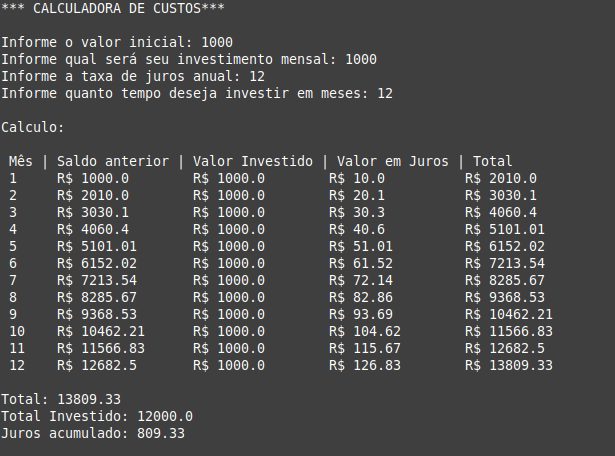

# calculadora-juros-compostos-python

## Descrição
Este projeto é uma calculadora básica de juros compostos criado em Python para estudos pessoais.



### Pré-requisitos
Antes de começar, você vai precisar ter instalado em sua máquina as seguintes ferramentas:

[Git](https://git-scm.com), [Python3](https://www.python.org/), [Pip](https://pip.pypa.io/en/stable/installation/)

### 🎲 Rodando o Projeto

```bash
# Faça um clone do repositório
$ git clone <https://github.com/SamuelNonoka/calculadora-juros-compostos-python.git>

# Acesse a pasta do projeto no terminal/cmd
$ cd calculadora-juros-compostos-python

# Instale as dependências
$ pip install

# Execute a aplicação
$ python app.py (python3 app.py)